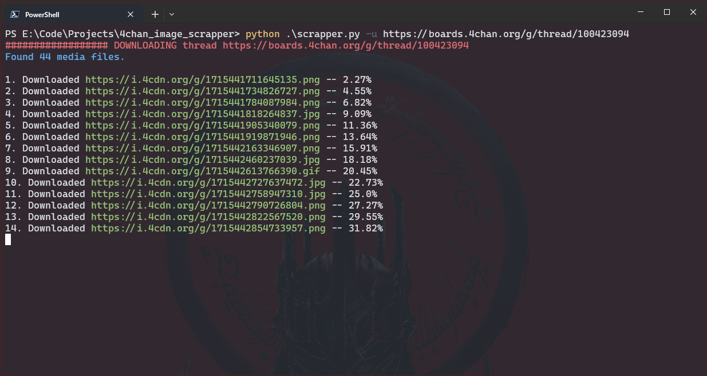

# 4chan_image_downloader
This script scrapes all files from a thread in 4chan and downloades it in a sub folder inside their respective board folder

## Usage
For downloading a single thread
```shell
python scrapper.py -u https://boards.4chan.org/g/thread/100423094
```
For downloading all threads listed in threads.txt
```shell
python scrapper.py
```


## Preview

